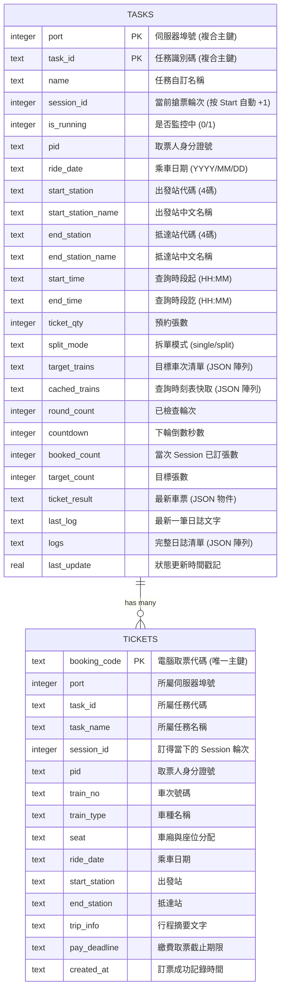

# 系統資料庫架構與規格說明書 (Database Specification)

本文件詳述本系統之 SQLite 統一資料庫（`autopilot.db`）之架構設計、資料表綱要（Schema）、資料字典（Data Dictionary）、關聯圖與常用查詢範本。

---

## 1. 資料庫概況 (Overview)

本系統全面拋棄分散的 JSON 狀態檔案，改以單一 SQLite 資料庫作為系統唯一的真相來源（Single Source of Truth, SSOT）。

| 屬性 | 規格設定 | 說明 |
| :--- | :--- | :--- |
| **資料庫引擎** | SQLite 3 | Python 內建 `sqlite3`，零外部套件依賴 |
| **儲存路徑** | `~/.Ry_autopilot/autopilot.db` | 固定儲存於使用者家目錄，確保在任何目錄執行皆使用同一份資料庫 |
| **日誌檔路徑** | `~/.Ry_autopilot/successful_tickets.txt` | 純文字人讀輔助歷史日誌 |
| **日誌模式** | **WAL (Write-Ahead Logging)** | `PRAGMA journal_mode = WAL;` 高並發讀寫互不阻塞 |
| **同步等級** | **NORMAL** | `PRAGMA synchronous = NORMAL;` 兼顧寫入效能與斷電資料安全 |
| **編碼格式** | UTF-8 | 完整支援多國語言車站名稱、行程描述與車票字元 |
| **後端封裝模組** | [`app/db.py`](file:///home/jimmy/testcode/tn_test/app/db.py) | 集中管理連線池、Schema 自動建表與原子性 CRUD 函數 |

---

## 2. 實體關聯圖 (Entity-Relationship Diagram)

系統架構採用**多 Port 隔離 + 多任務並行（Multi-Port / Multi-Task Sessions）**：
- 每個連線埠號（`port`）下可擁有數個獨立的搶票任務（`tasks`）。
- 每個任務（`task`）每次啟動監控時會自動開啟新一輪 Session（`session_id` 遞增）。
- 每張車票（`tickets`）皆關聯至對應的 `port`、`task_id` 以及訂得當下的 `session_id`。



---

## 3. 資料字典 (Data Dictionary)

### 3.1 `tasks` 表：任務配置與運行狀態表
- **儲存目的**：記錄每個 Port 底下所有搶票任務的行程條件（Config）與即時運行進度（Runtime State）。
- **主鍵定義**：`PRIMARY KEY (port, task_id)`

| 欄位名稱 | 型態 (SQLite) | 允許空值 | 預設值 | 業務說明與範例 |
| :--- | :--- | :---: | :--- | :--- |
| `port` | INTEGER | 否 | - | 連線埠號（例如 `8082`, `8083`） |
| `task_id` | TEXT | 否 | - | 任務識別碼（例如 `default`, `task_1790079735_969b`） |
| `name` | TEXT | 否 | - | 任務自訂名稱（例如 `宜蘭`, `任務 2`） |
| `session_id` | INTEGER | 是 | `1` | 當前搶票輪次，每次按下【開始監控】自動 `+1` |
| `is_running` | INTEGER | 是 | `0` | 是否正在背景監控撿票（`0`: 待命, `1`: 運行中） |
| `pid` | TEXT | 是 | `''` | 取票身分證字號（例如 `A123456789`） |
| `ride_date` | TEXT | 是 | `''` | 乘車日期（格式：`YYYY/MM/DD`，例如 `2026/10/16`） |
| `start_station` | TEXT | 是 | `'1000'` | 出發火車站代碼（4 碼數字，例如 `1000` 為臺北） |
| `start_station_name` | TEXT | 是 | `'臺北'` | 出發站中文站名 |
| `end_station` | TEXT | 是 | `'1020'` | 抵達火車站代碼（例如 `1020` 為板橋） |
| `end_station_name` | TEXT | 是 | `'板橋'` | 抵達站中文站名 |
| `start_time` | TEXT | 是 | `'08:00'` | 搜尋發車時間起點（格式：`HH:MM`） |
| `end_time` | TEXT | 是 | `'12:00'` | 搜尋發車時間迄點（格式：`HH:MM`） |
| `ticket_qty` | INTEGER | 是 | `1` | 搶票張數（每班目標張數或時段總張數） |
| `split_mode` | TEXT | 是 | `'single'` | 模式：`single`（整筆多志願）或 `split`（單張拆單） |
| `target_trains` | TEXT | 是 | `'[]'` | 監控目標車次編號清單（JSON 陣列字串，如 `["123", "117"]`） |
| `cached_trains` | TEXT | 是 | `'[]'` | 時刻表快取清單（JSON 陣列字串） |
| `round_count` | INTEGER | 是 | `0` | 背景程序已累積檢查座位次數 |
| `countdown` | INTEGER | 是 | `0` | 距離下一次輪詢剩餘秒數 |
| `booked_count` | INTEGER | 是 | `0` | 當前 Session 內已成功訂得的票券張數 |
| `target_count` | INTEGER | 是 | `1` | 本任務目標訂票總張數 |
| `ticket_result` | TEXT | 是 | `NULL` | 最新成功之車票摘要物件（JSON 字串） |
| `last_log` | TEXT | 是 | `''` | 最新一則執行記錄或狀態摘要 |
| `logs` | TEXT | 是 | `'[]'` | 完整執行日誌列表（JSON 陣列字串） |
| `last_update` | REAL | 是 | `0` | 最後更新時間戳（Unix Timestamp 毫秒） |

---

### 3.2 `tickets` 表：成功訂得車票庫
- **儲存目的**：永久儲存全系統所有成功訂得的車票資料。支援 Session 檢視、Booking History 匯總以及線上退票連動。
- **主鍵定義**：`PRIMARY KEY (booking_code)`

| 欄位名稱 | 型態 (SQLite) | 允許空值 | 預設值 | 業務說明與範例 |
| :--- | :--- | :---: | :--- | :--- |
| `booking_code` | TEXT | 否 | - | 官方電腦訂票代碼（主鍵，例如 `6845299`） |
| `port` | INTEGER | 否 | - | 取得該票券時的伺服器埠號 |
| `task_id` | TEXT | 否 | - | 取得該票券的任務代碼 |
| `task_name` | TEXT | 是 | `''` | 取得該票券的任務名稱（供歷史紀錄顯示徽章，如 `任務 2`） |
| `session_id` | INTEGER | 否 | - | 該任務訂得車票時的 Session ID |
| `pid` | TEXT | 是 | `''` | 取票身分證字號 |
| `train_no` | TEXT | 是 | `''` | 車次編號（例如 `123`） |
| `train_type` | TEXT | 是 | `''` | 車種名稱（例如 `自強`, `新自強(3000)`） |
| `seat` | TEXT | 是 | `''` | 車廂與座位資訊（例如 `8車22號`） |
| `ride_date` | TEXT | 是 | `''` | 乘車日期（例如 `2026/10/16`） |
| `start_station` | TEXT | 是 | `''` | 起程站名稱（例如 `臺北`） |
| `end_station` | TEXT | 是 | `''` | 到達站名稱（例如 `板橋`） |
| `trip_info` | TEXT | 是 | `''` | 行程完整說明字串（例如 `10/16(星期五) 11:59 臺北 到 12:07 板橋`） |
| `pay_deadline` | TEXT | 是 | `''` | 官方繳費取票截止時間（例如 `09/25 (Fri) 24:00`） |
| `created_at` | TEXT | 是 | `CURRENT_TIMESTAMP` | 訂票成功記錄時間戳記（`YYYY-MM-DD HH:MM:SS`） |

---

## 4. 索引設計 (Index Design)

為確保在大量日誌或歷史紀錄查詢時依然具備極高反應速度，建立了以下專屬 B-Tree 索引：

1. **`idx_tasks_port`**：
   - 結構：`CREATE INDEX IF NOT EXISTS idx_tasks_port ON tasks(port);`
   - 用途：加速指定 Port（如 8082）載入所有任務清單時的檢索。
2. **`idx_tickets_port_task`**：
   - 結構：`CREATE INDEX IF NOT EXISTS idx_tickets_port_task ON tickets(port, task_id, session_id);`
   - 用途：供 Start/Stop 按鈕下方「本次 Session 訂票狀況」卡片在極短時間內（毫秒級）精準拉取當次車票。
3. **`idx_tickets_created`**：
   - 結構：`CREATE INDEX IF NOT EXISTS idx_tickets_created ON tickets(created_at);`
   - 用途：供右上角「Booking History」彈窗進行時間倒序分頁排列。

---

## 5. 常見核心業務 SQL 範本

### 5.1 查詢特定任務「本次 Session 訂票狀況」
```sql
SELECT booking_code, train_no, train_type, seat, trip_info, pay_deadline, created_at
FROM tickets
WHERE port = 8082 
  AND task_id = 'task_1790079735_969b' 
  AND session_id = 1
ORDER BY created_at ASC;
```

### 5.2 查詢「Booking History (全域成功車票歷史紀錄)」
```sql
SELECT booking_code, train_no, train_type, seat, ride_date, trip_info, pay_deadline, task_name, created_at
FROM tickets
ORDER BY created_at DESC;
```

### 5.3 線上退票 / 刪除車票（原子性連動消除）
```sql
-- 一筆 SQL 刪除，本次 Session 明細與歷史紀錄瞬間同步更新
DELETE FROM tickets WHERE booking_code = '6845299';
```

### 5.4 啟動新一輪監控（開啟新 Session）
```sql
-- 每次按 Start，session_id 自增 1，歷史紀錄繼續保留，當次 Session 自動歸零
UPDATE tasks 
SET session_id = session_id + 1,
    is_running = 1,
    round_count = 0,
    booked_count = 0,
    last_update = strftime('%s', 'now')
WHERE port = 8082 AND task_id = 'task_1790079735_969b';
```

---

## 6. 資料庫日常維護指南 (Maintenance Guide)

### 6.1 透過終端機 CLI 直接查閱資料庫
若需要在 Linux / macOS 終端機直接檢視資料庫，可使用 `sqlite3` CLI 工具：

```bash
# 開啟資料庫
sqlite3 ~/.Ry_autopilot/autopilot.db

# 檢視所有表
sqlite> .tables

# 漂亮表格模式輸出
sqlite> .mode table

# 查詢所有任務
sqlite> SELECT port, task_id, name, session_id, is_running FROM tasks;

# 查詢所有成功車票
sqlite> SELECT booking_code, train_no, task_name, seat, pay_deadline FROM tickets;

# 退出
sqlite> .exit
```

### 6.2 備份資料庫
由於 SQLite 啟用了 WAL 模式，建議使用 SQLite 內建的線上備份指令進行安全熱備份（不影響執行中的撿票程式）：

```bash
sqlite3 ~/.Ry_autopilot/autopilot.db ".backup ~/.Ry_autopilot/autopilot_backup.db"
```

### 6.3 資料庫重整與收縮 (Vacuum)
經過多次退票與刪除後，若想回收磁碟空間並整理碎片：
```bash
sqlite3 ~/.Ry_autopilot/autopilot.db "VACUUM;"
```
